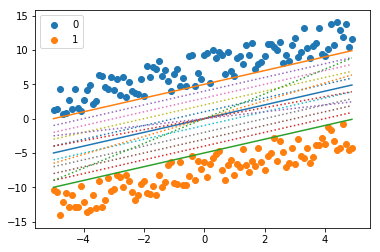

[GitHub](https://ranmaosong.github.io/2019/03/26/ML-hard-margin-svm/)
[简书](https://www.jianshu.com/p/3938e0f22692)
[CSDN](https://blog.csdn.net/u014630987/article/details/88845317)

# 1 线性可分支持向量机
支持向量机(Support vector machines, SVM)是一种**二分类模型**，它的基本模型是定义在特征空间上的间隔最大的线性分类器，他的学习策略就是间隔最大化，同时该方法可以形式化为一个求解图二次规划。

支持向量机可分为三类:

1. 线性可分支持向量机、硬间隔（hard-margin svm)
2. 线性支持向量机、软间隔(soft-margin svm)
3. 非线性支持向量机、Kernel SVM

支持向量机模型中存在三宝:

1. 间隔
2. 对偶
3. 核技巧

支持向量机和感知机在某些方面很相似，其相同点:
1. 都是二分类模型
2. 都是通过一个分离超平面对特征进行分类
   
不同点：

1. SVM 是特殊的感知机
2. 感知机是用误分类最小的策略，求得分离超平面，这时存在无穷个解，感知机利用间隔最大化求得最优分离超平面。如下图所示
   

图1 感知机与支持向量机区别

图中的蓝色和黄色圆点分别表示正负样本，对于这个二分类，从图中我们可知，在最上面的黄线和最下面的绿线之间的线条都是可以把训练样本集完全分开的，这就是感知机的原理，通过这些分离超平面把训练集分开，这样的分离超平面存在很多条，比如图中的虚线，从视觉上中间那条实线应该是众多线条中最优的一条，感知机对于学习的分离超平面由于优化算法、学习率等不同因素，会随机地学习到这众多分离超平面中的一条，当学习到的是靠近上下边缘的分离超平面是，对于一个未知样本，当这个样本稍微浮动一下，模型就很可能对他进行误分类了，因此鲁棒性很低，而支持向量机的目标是找到图中中间那条最优的分离超平面。

**定义(线性可分支持向量机)**:给定线性可分训练数据集，通过间隔最大化或等价地求解相应的凸二次规划问题学习得到一个分离超平面:

$$
 w^* \cdot x + b^* =0
\tag{1}
$$
即相应的决策模型:

$$
    f(x)=sign(w^* \cdot x + b^*)
    \tag{2}
$$
此模型就为线性可分支持向量机。其中 $ w^*$ 表示分离超平面的法向量， $b^*$ 表示截距，位于分离超平面之上的样本为正样本，之下的为负样本。

# 2 函数间隔和几何间隔

一般来说，一个点到分离超平面的远近可以表示分类预测的确信程度，在给定分离超平面$w \cdot x + b = 0$的情况下， $|w \cdot x + b|$能够相对地表示点 $x$ 到分离超平面的远近。同时 $w \cdot x + b$的符号与类别标记 $y$ 是否保持一致来表示分类是否正确，所以，可以用$y(w \cdot x + b)$ 来表示分类的正确性及确信度，这就是函数间隔（functional margin)的概念。

**定义(函数间隔)**:对于给定训练数据集 $T$ 和超平面 $(w, b)$,定义超平面 $(w, b)$ 关于样本点 $(x_i,y_i)$ 的函数间隔为:

$$
\hat \gamma_i = y_i(w \cdot x_i + b)
\tag{3}
$$

分离超平面关于训练数据集 $T$ 的函数间隔为超平面关于 $T$ 中所有样本点 $(x_i,y_i)$ 的函数间隔最小值:

$$
\hat \gamma = \min_{i=1...N}y_i(w \cdot x_i + b)
\tag{4}
$$

上述定义是在给定超平面 $(w,b)$ 的时候计算，然而在实际支持向量机的学习过程中，只有函数间隔是不够的，因为当 $w$ 和 $b$ 按比例同时扩大 $n$ 倍，此时函数间隔也扩大 $n$ 倍，而超平面并没有改变。因此我们需要对分离超平面加以约束，如规范化，$||w||=1$,使得间隔不随 $w$ 和 $b$ 成比例扩大而改变。这时函数间隔就成为了几何间隔（geometric margin)

**定义(几何间隔)**:对于给定训练数据集 $T$ 和超平面 $(w, b)$,定义超平面 $(w, b)$ 关于样本点 $(x_i,y_i)$ 的几何间隔为:

$$
 \gamma_i = y_i(\frac{w}{||w||} \cdot x_i + \frac{b}{||w||})
\tag{5}
$$

分离超平面关于训练数据集 $T$ 的函数间隔为超平面关于 $T$ 中所有样本点 $(x_i,y_i)$ 的函数间隔最小值:

$$
\gamma = \min_{i=1...N} \gamma_i
\tag{6}
$$

$||w||$ 为 $w$ 的 $L_2$ 范数。其实上述公式就是我们中学时候学习的点到直线的距离公式的推广，或者说点到直线的距离公式是该公式在二位平面下的表示。

通过公式4和公式6的比较，我们可以得出函数间隔和几何间隔有如下关系:

$$
\begin{aligned}
    \gamma_i =& \frac{\hat \gamma_i}{||w||} \\
    \gamma =& \frac{\hat \gamma}{||w||}
\end{aligned}
\tag{7}
$$

# 3 间隔最大化

支持向量机学习的基本思想是求解能够**正确划分训练数据集**且**几何间隔最大**的分离超平面。间隔最大化的直观解释是：使分类决策模型以较大的确信度来对数据集分类，同时对离超平面较近的点也有很大的确信度。

因此，最大间隔支持向量机形式化为:

$$
\begin{aligned}
    &\max_{w,b}\quad\gamma \\
    &s.t. \quad y_i(\frac{w}{||w||} \cdot x_i + \frac{b}{||w||}) \geq\gamma, i=1,2,...,N
\end{aligned}
\tag{8}
$$

也即:

$$
\begin{aligned}
    &\max_{w,b}\quad \frac{\hat \gamma}{||w||} \\
    &s.t. \quad y_i(\frac{w}{||w||} \cdot x_i + \frac{b}{||w||}) \geq \hat \gamma, i=1,2,...,N
\end{aligned}
\tag{9}
$$

我们得知函数间隔$\hat \gamma$的取值并不影响模型的最优化问题，将 $w$ 和 $b$ 成比例的改变 $\lambda$ 倍，函数间隔也变成 $\lambda \hat \gamma$,这一改变对上面最优化的不等式约束并没有印象，因此，我们可以令 $\hat \gamma=1$,于是上述公式就等价于:

$$
\begin{aligned}
    & \min_{w,b} \quad \frac{1}{2}||w||^2 \Rightarrow \frac{1}{2}w^T    w\\
    & s.t. \quad y_i(w \cdot x_i + b)-1 \geq 0, i=1,2,...,N
\end{aligned}
\tag{10}
$$

此时，SVM优化问题变为一个凸二次规划问题，利用拉格朗日乘子法即可求出最优的 $(w^*,b^*)$

# 4 学习的对偶算法

为求解支持向量机的最优化问题，我们将公式10作为原始问题，应用拉格朗日对偶性，通过求解对偶问题(dual problem)得到原始问题(primal problem)的最优解，这就是支持向量机的对偶算法。这样做的**优点**:

1. 对偶问题往往更容易求解；
2. 自然引入核函数，进而推广到非线性可分分类问题；
   
通过对公式10的约束条件引入拉格朗日乘子$\alpha_i\geq 0,i=1,2,...,N$,构建出拉格朗日函数：

$$
\begin{aligned}
    L(w, b, \alpha)=&\frac{1}{2}w^Tw+\sum_{i=1}^{N}\alpha_i(1-y_i(w^T x_i + b)) \\
    =& \frac{1}{2}w^Tw-\sum_{i=1}^{N}\alpha_i y_i(w^T x_i + b) +\sum_{i=1}^{N}\alpha_i
\end{aligned}
\tag{11}
$$

我们称公式10为带约束的原始问题，根据拉格朗日对偶性，原始问题的对偶问题是极大极小问题
$$
\max_{\alpha}\min_{w,b}L(w, b, \alpha)
\tag{12}
$$

公式12和原始公式存在一种弱对偶关系，当等号成立时为强对偶关系:

$$
\min_{w,b}\max_{\alpha} L(w, b, \alpha) \geq \max_{\alpha}\min_{w,b} L(w, b, \alpha)
\tag{13}
$$

此时我们就可以按照利用拉格朗日对偶性求解问题的标准模型，求解出$w, b, \alpha$.

1. **求 $\min_{w,b}L(w, b, \alpha)$**
   
   将拉格朗日函数 $L(w, b, \alpha)$ 分别对 $w,b$求偏导，并令其值为0.

$$
\begin{aligned}
    & \frac{\partial L}{\partial w} = w - \sum_{i=1}^{N}\alpha_i y_i x_i =0 \\
    & \Rightarrow w = \sum_{i=1}^{N}\alpha_i y_i x_i
\end{aligned}
\tag{14}    
$$

$$
\begin{aligned}
    & \frac{\partial L}{b}=-\sum_{i=1}^{N}\alpha_iy_i=0 \\
    & \Rightarrow \sum_{i=1}^{N}\alpha_iy_i=0
\end{aligned}
\tag{15}
$$

将公式14和15带入公式11得:

$$
\begin{aligned}
    \min_{w,b} L(w, b,\alpha)=&\frac{1}{2} (\sum_{i=1}^{N}\alpha_i y_i x_i)^T \sum_{i=1}^{N}\alpha_i y_i x_i-\sum_{i=1}^{N}\alpha_i y_i((\sum_{i=1}^{N}\alpha_i y_i x_i)^T x_i + b) +\sum_{i=1}^{N}\alpha_i \\
    =&\frac{1}{2}\sum_{i=1}^{N}\sum_{j=1}^{N}\alpha_i y_i\alpha_j y_jx_i^Tx_j-\sum_{i=1}^{N}\sum_{j=1}^{N}\alpha_i y_i\alpha_j y_jx_j^Tx_i+\sum_{i=1}^{N}\alpha_i \\
    =& -\frac{1}{2}\sum_{i=1}^{N}\sum_{j=1}^{N}\alpha_i y_i\alpha_j y_jx_i^Tx_j+\sum_{i=1}^{N}\alpha_i
\end{aligned}
\tag{16}
$$

2. **求 $\min_{w,b}L(w, b,\alpha)$**对 $\alpha$ 的极大值，即对偶问题:

$$
\begin{aligned}
    & \max_{\alpha} -\frac{1}{2}\sum_{i=1}^{N}\sum_{j=1}^{N}\alpha_i y_i\alpha_j y_jx_i^Tx_j+\sum_{i=1}^{N}\alpha_i \\
    & s.t. \quad \sum_{i=1}^{N}\alpha_iy_i=0 \\
    & \quad \quad \alpha_i \geq 0,i=1, 2...N
\end{aligned}
\tag{17}
$$

将上式转化为求极小值

$$
\begin{aligned}
    & \min_{\alpha} \frac{1}{2}\sum_{i=1}^{N}\sum_{j=1}^{N}\alpha_i y_i\alpha_j y_jx_i^Tx_j-\sum_{i=1}^{N}\alpha_i \\
    & s.t. \quad \sum_{i=1}^{N}\alpha_iy_i=0 \\
    & \quad \quad \alpha_i \geq 0,i=1, 2...N
\end{aligned}
\tag{18}
$$

上式可以继续利用凸二次规划来求解 $\alpha^*=(\alpha_1^*,\alpha_2^*,...,\alpha_N^*)$,然后可由$\alpha^*$求得原始问题对 $(w,b)$ 的解 $w^*,b^*$。

**定理** 设 $\alpha^*=(\alpha_1^*,\alpha_2^*,...,\alpha_N^*)$ 是对偶问题（即公式18）的解，则存在下标 $j$,使得 $\alpha_j > 0$,并按如下公式求得$w^*,b^*$

$$
    w^*=\sum_{i=1}^{N} \alpha_i^*y_ix_i
    \tag{19}
$$

$$
    b^*=y_j-\sum_{i=1}^{N} \alpha_i^*y_i(x_i^Tx_j)
    \tag{19}
$$

**证明**
根据拉格朗日某定理，KKT条件成立，即:

$$
\begin{aligned}
    & \frac{\partial L(w^*,b^*,\alpha ^*)}{\partial w} = w^*-\sum_{i=1}^{N}\alpha_i^* y_i x_i=0 \\
    & \frac{\partial L(w^*,b^*,\alpha ^*)}{\partial b} = -\sum_{i=1}^{N}\alpha_i^*y_i=0 \\
    & \frac{\partial L(w^*,b^*,\alpha ^*)}{\partial \alpha} = 0 \\
    & \alpha_i(1-y_i(w^Tx_i+b)) =0  \\
    & \alpha_i \geq 0 , i=1,2,...,N \\
    & 1-y_i(w^Tx_i+b) \leq 0 , i=1,2,...,N
\end{aligned}
\tag{20}
$$

此时，公式13具有强对偶关系，即等号成立。根据支持向量机的特点，至少存在一个 $\alpha_j >0$,即对于支持向量（后面讲解），对此j有

$$
1-y_j(w^Tx_j+b) = 0 \Rightarrow y_j(w^{*^T}x_j+b) = 1
\tag{21}
$$

由于 $y_j$ 为1或-1，上式两边同乘以一个 $y_i$ 得：

$$
\begin{aligned}
    b^* =& y_j - w^{*^T}x_j \\
        =& y_j - \sum_{i=1}^{N} \alpha_i^*y_i(x_i^Tx_j)
\end{aligned}
\tag{22}
$$

从上面的推导我们可以看出，$w^*$ 和 $b^*$只依赖于训练数据中对应于 $\alpha_i^* > 0$的样本点 $(x_i, y_i)$,而其他样本点对 $w^*$ 和 $b^*$ 没有印象，我们把这些$\alpha_i^* > 0$ 的样本点称为支持向量。这些样本点一定位于间隔边界上。

[文中绘图源码](https://github.com/RanMaosong/Machine-Learning-LiHang/blob/master/code/%E7%AC%AC%E4%B8%83%E7%AB%A0%20%E6%94%AF%E6%8C%81%E5%90%91%E9%87%8F%E6%9C%BA/Plot.ipynb)